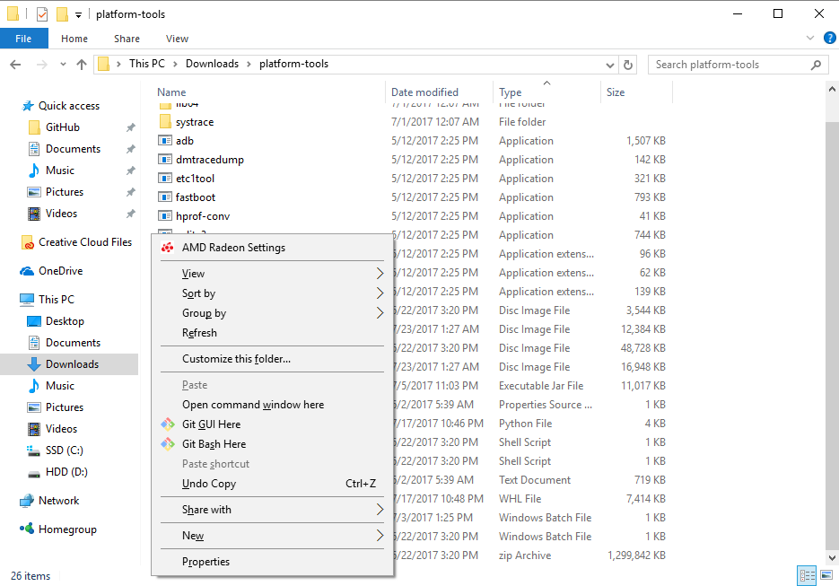
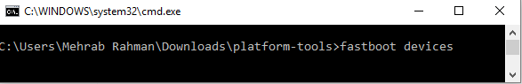
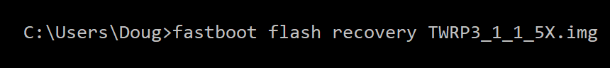

##### 
*原文[《Nexus 5X Bootloop Fix Helps you to Finally Boot the Phone》][1]，原文作者：[Doug Lynch][3]，源自 [xda-developers.com][2]网站*

&#8195;&#8195;你的LG/Google [Nexus 5X][4]手机停止启动了吗？或者是陷入到了无休止的启动循环里了？
&#8195;&#8195;这种现象我们常称之为“循环启动”，起因则有很多种。大多数时候，可以通过刷入原厂固件或者恢复出厂设置来解决循环启动问题，但当遇到硬件循环启动时，通常我们并不能采取什么有效的办法，除了退货。如果你的Google Nexus 5X手机无法启动，而你尝试修复但并没有什么卵用，那么你要相信，你不是唯一一个碰到这种情况的人。Nexus 5X循环启动问题在社区里正不断被诟病，但鲜有新的解决方案。
### Nexus 5X循环启动解决 - 背景
&#8195;&#8195;过去几年里，LG旗下的智能手机在循环启动问题上有点名声。其中一个问题，起初只在[LG G4][5]手机上发现的问题正越来越多的出现在它发布的每一款新设备上。社区里最近在讨论*[解决Nexus 6P循环启动问题][6]*，这个设备由华为出品，而现在，一个在[Nexus 5X][7]上可行的办法出现了，这个办法派生自我们之前写的一些引导方案。
&#8195;&#8195;这些解决方案有一个共同点，正表明由高通仓促发布的骁龙808/810芯片，随着使用时间的推移，正在达到退化并损坏的时候了。*[骁龙810发热问题][8]*都已经老生常谈了，但是，似乎808芯片也存在相同的问题，将导致设备循环启动。LG起初承认了*[LG G4循环启动问题确实和硬件有关][9]*，但从未提供更多深入的信息。
&#8195;&#8195;一些质疑认为是焊锡的问题，在设备的使用过程中，在经历多次的加热和冷却后，焊锡会破裂。不管是否是真因，我们还是不知道问题的背后是什么，但是这个办法看起来会对Nexus 5X循环启动的问题起效。今天我们带来一个引导，真正的帮助你解决Nexus 5X循环启动问题。这则帖子末尾的讨论链接表明这个办法是未经测试的，社区里的许多用户已经报告了用这个办法可以成功。
&#8195;&#8195;一如既往，你可以使这个方法多样化。
### 教程
###### 要求
* *设备在循环启动问题发生前，bootloader要处于"可解锁"状态。在这之前，如果你能启动设备，去到开发者选项里，点击“允许OEM解锁”，就能达到bootloader解锁的状态。*
1. 下载最新的[ADB和Fastboot][10]，将它们解压到电脑上容易访问到的位置。<!-- more -->
2. 下载安装[谷歌USB驱动][11] (针对windows平台)
3. 下载[N2G47Z_4Cores.img][12]文件，并保存到与ADB&Fastboot相同的目录下。
 * 可选项1：如果想要在Nexus 5X上使用TWRP recovery，则需要一个TWRP的修改版本。下载[TWRP3_1_1_5X.img][13]，并保存到与ADB&Fastboot相同的目录下。
 * 可选项2：如果想要加快Nexus 5X的运行速度，则可以刷入一个经过XDA认证的[flar2][14]的修改版本基带内核。下载[EX4_10_5X.zip][15]文件到Nexus 5X上默认的下载目录。
4. 将Nexus 5X通过USB线与电脑连接。
5. 启动电脑命令行工具并定位到之前保存ADB&Fastboot的目录下，对于Windows用户，只需要资源管理器进入到这个目录下，点击鼠标右键，选择"open commad promote here"，即，“在这里打开命令行”即可，Windows10用户可以选择PowerShell替代。
6. 启动Nexus 5X并进入到Fastboot模式(同时按住电源键及音量下键)。
7. 在命令行执行命令: *fastboot devices*
8. 如果能看到显示的设备序列号，则可以继续，如果没有，则可能是因为某些原因，USB驱动没有安装好，需要检查。
9. 如果bootloader未解锁而之前已经在手机开发者选项里进行了OEM解锁，则现在可以解锁bootloader了，命令行输入: *fastboot flashing unlock* 然后，跟着命令行提示进行bootloader解锁，需要注意的是，这个操作会清除手机上的所有数据。
10. 接着进行替换boot镜像，输入命令: *fastboot flash boot N2G47Z_4Cores.img*
 * 如果想要刷入TWRP，使用命令: *fastboot flash recovery TWRP3_1_1_5X.img*
11. 输入命令: *fastboot reboot*来重启手机
12. 几分钟后(可能更长)，应该可以看到开机动画在屏幕上闪动，那么恭喜你，你拯救了你的爱机！
13. 可选项: 如果想要改进手机的表现力，可以遵照以下步骤来安装TWRP，拷贝之前下载的基带内核文件到手机内置存储器上，启动手机并进入到TWRP，并刷入内核。这时你甚至可以选择通过超频来加快手机的运行速度。

### 说明
&#8195;&#8195;就像我们之前呈现的解决Nexus 6P循环启动问题解决指引一样，在现在SOC的大集群CPU时代，有许多原因会造成这些问题。XDA会员[XCnathan32][16]在测试时发现，这个问题是由于VLL在A57内核里无法获取进程锁造成的。目前，我们也未100%肯定是这个原因引起这个问题，但是，我们的解决办法都是在不让A57内核损坏的情况下达成，成功解决了问题。
&#8195;&#8195;更好的解决办法未来会出现，但现在，我们很感激有开发者社区里出现了解决方案，让人们的手机获得重生。那些解决了这些问题的人，他们至少都有相关的设备，例如音乐播放器等，在他们第一次面对循环启动的问题时，他们至少有了一个可行的解决办法。
&#8195;&#8195;就像前面所说的，我们看到了社区里有人反应这个方法(XDA官方方法)确实可行。然而，我们也确实看到不止一个用户反馈这对于他们没有效果。引起Nexus 5X循环启动的原因有很多，所以我们的指引可能并不适用于所有人。如果你的Nexus 5X正在经历循环启动的遭遇，而你想重置所有这些修改过的文件，也将不会对你以后想刷入谷歌提供的固件镜像有什么影响。
#### *[这里可以查看我们之前关于Nexus 5X的帖子][17]*

[1]: https://www.xda-developers.com/nexus-5x-bootloop-fix-boot-phone/
[2]: https://www.xda-developers.com/
[3]: https://www.xda-developers.com/author/doug-lynch/
[4]: https://forum.xda-developers.com/nexus-5x
[5]: https://forum.xda-developers.com/g4
[6]: https://www.xda-developers.com/nexus-6p-bootloop-fix/
[7]: https://forum.xda-developers.com/nexus-5x
[8]: https://www.xda-developers.com/opinion-the-810-held-back-a-generation-with-deliberate-apologism-damage-control/
[9]: https://www.xda-developers.com/xda-external-link/lg-admits-g4-bootloop-problem-is-a-hardware-fault-will-repair-affected-devices/
[10]: https://www.xda-developers.com/google-releases-separate-adb-and-fastboot-binary-downloads/
[11]: https://developer.android.com/studio/run/win-usb.html
[12]: https://www.dropbox.com/s/tm7qt98r6d7q2a6/N2G47Z_4Cores.img?dl=0
[13]: https://www.dropbox.com/s/levla3p5npe24pw/TWRP3_1_1_5X.img?dl=0
[14]: https://forum.xda-developers.com/member.php?u=4684315
[15]: https://www.dropbox.com/s/172ey8346e5du6l/EX4_10_5X.zip?dl=0
[16]: https://forum.xda-developers.com/member.php?u=5288606
[17]: https://forum.xda-developers.com/nexus-5x/general/untested-nexus-5x-bootloop-death-fix-t3641199