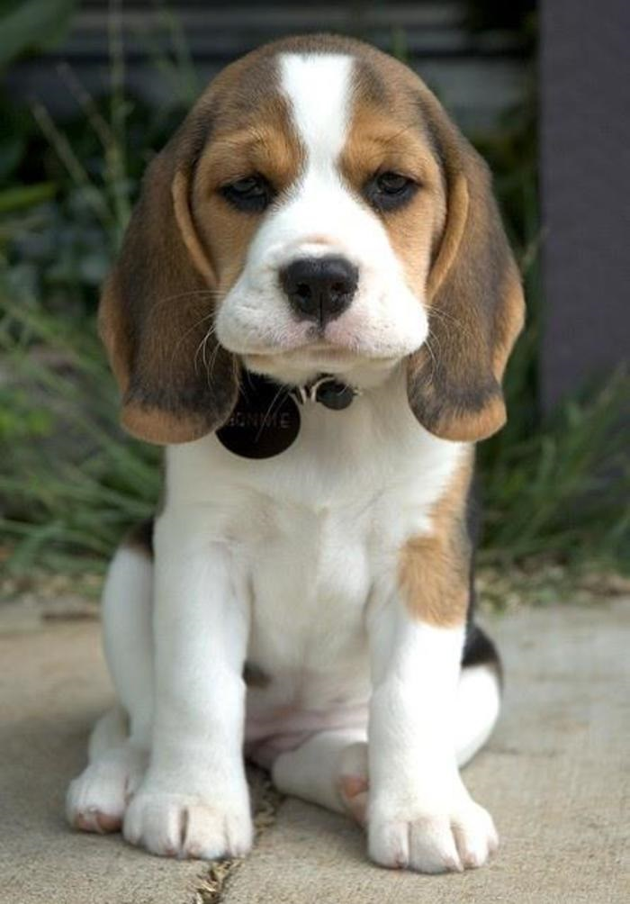

### 听说这样可以图文并茂 ###

这是一段文字，当这段文字出现的时候，会伴随着图片，你看到了吗？
这是传说中的相对路径方式

下面是markdown方式

好了，真的都有看到吗？
再来一张大图看看Let's give the situation a little context: 

No one really knew what would happen to Armstrong and Aldrin on the moon. That's uncertain enough, but Collins was waiting to find out while floating all alone as far as humanity has ever traveled. President Nixon even had a speech prepared if Eagle's engine were to fail and Collins came home alone: "Fate has ordained that the men who went to the Moon to explore in peace will stay on the Moon to rest in peace. These brave men, Neil Armstrong and Edwin Aldrin, know that there is no hope for their recovery. But they also know that there is hope for mankind in their sacrifice." As haunting as that would-be speech are Collins' own writings while isolated in Columbia. Fear was an understatement.

<!-- more -->
As The Guardian reports, Collins wrote while inside the CM, "My secret terror for the last six months has been leaving them on the Moon and returning to Earth alone; now I am within minutes of finding out the truth of the matter. If they fail to rise from the surface, or crash back into it, I am not going to commit suicide; I am coming home, forthwith, but I will be a marked man for life and I know it."

Space.com reported on the words Collins wrote as he drifted behind the moon, cutting off his communication with Earth: "I am alone now, truly alone, and absolutely isolated from any known life. I am it. If a count were taken, the score would be three billion plus two over on the other side of the moon, and one plus God knows what on this side."

Apollo 11 was Collins' second and final mission in space. And— spoiler alert—it was a groundbreaking success. Though he isn't the first or even second name that comes to mind when remembering the historic mission, Collins told The Guardian "it was an honour" to even be involved.