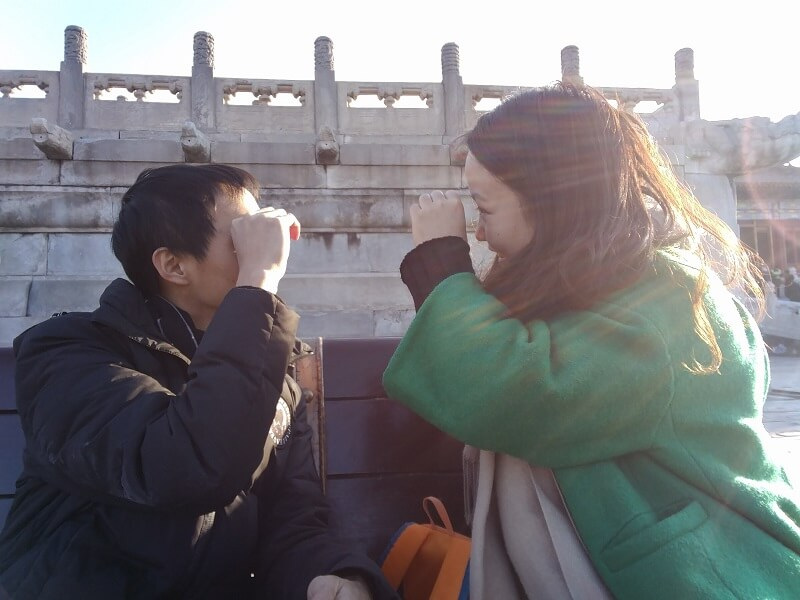

一个月的时间，如何叙说一年、十年的时光？幕布开启，似乎尽是美好

十年前，素不相识的我们成了大学同窗，活泼的你，安静的我，像是没有什么交集。青春，阳光，笑声，舞蹈，你永远是人群里的焦点，像是自带光环，亮亮的；我腼腆，远观，偶尔，跟着笑一笑，开一开心

生活在打乱着我的思绪，你是否也是，这段经历，好在我们都能调整心态过来，相信该是我们的会是我们的，我们努力了就好，但也认识到，以前总觉得自己已经努力了，显然，自己努力的还不够，为了我们一个更好的未来，还需要更多的努力。

贾老师，这件事情如果我做不好，我会看不起自己，我不是那么浪漫的人，这些都是我的方式，尽我所能，我花了很多时间去想这个事情，我确定这件事情对我很重要，当我发现我无论怎样准备都会让我觉得完美的时候，我焦虑，绝望，想写很多东西，作为这件事情的仪式感，我们很需要这个仪式感，我把它当成我这辈子最重要的时刻之一。

昨天，我们刚和几位大学同学共同度过了大学毕业六周年的日子，一起讨论着大家的过去，现在和未来，很开心。九月份，作为同学，我们将迎来相识十周年，很奇妙的时光，生命中，缘何我们能遇到了一起。

这些过去，如果说成因为有这些巧合的过去，才有如今的我们，那就太勉强矫情了，我们自己才清楚是怎么过来的。如今，我们时常感叹这些过往的时光，稍有差池，可能真的不会有今天的样子，你少摘一颗橘子，我多掏一窝鸟，你小学不留级，我高中不复读，
